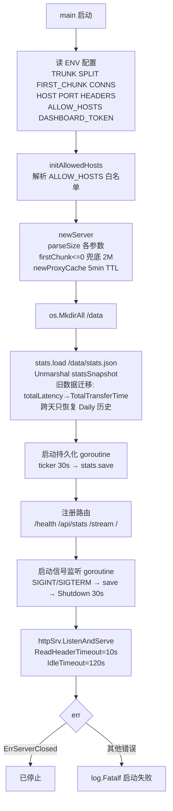
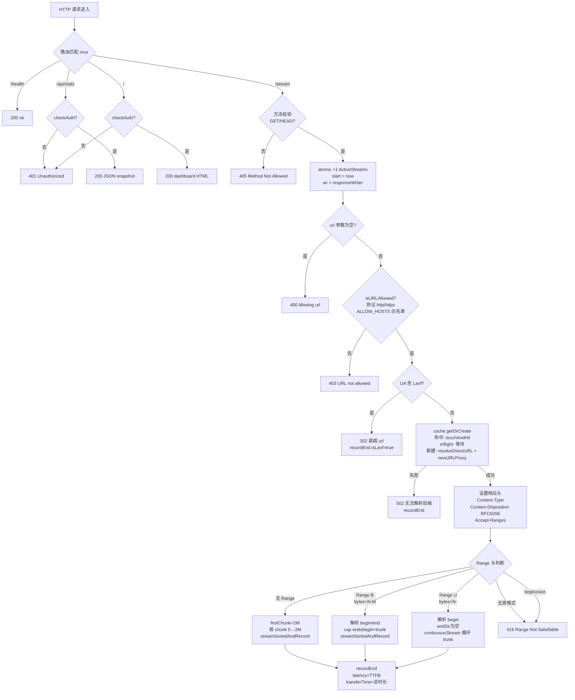
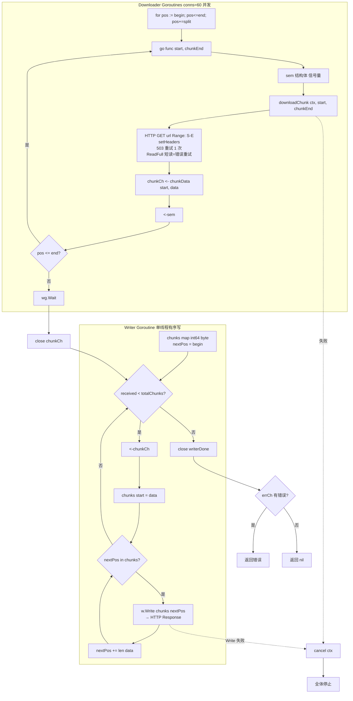
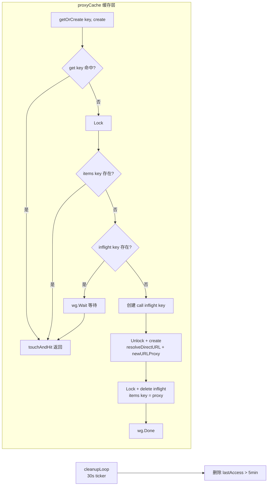
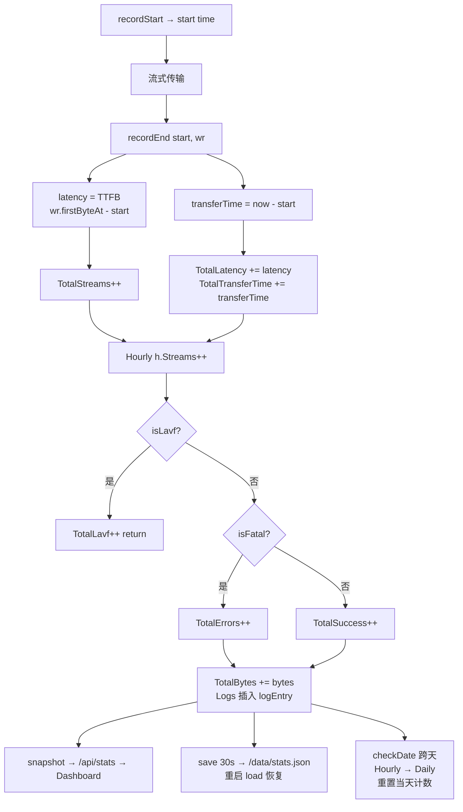
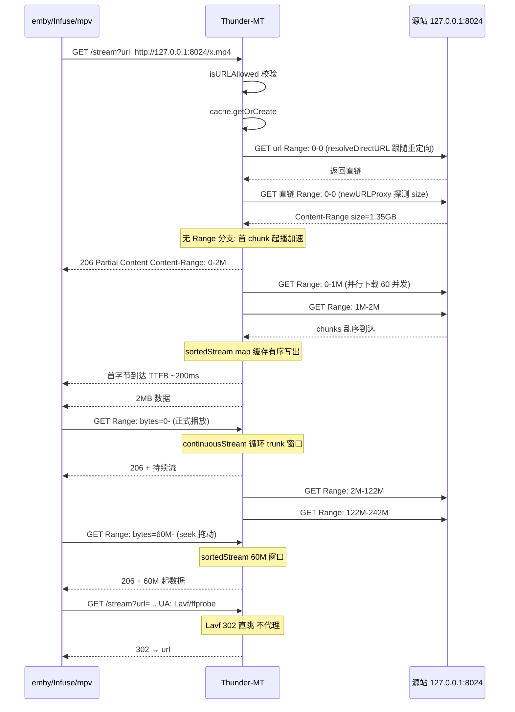

# Thunder-MT
此项目仅用于交流和学习。
此项目仅用于交流和学习。
此项目仅用于交流和学习。
多分片并行下载代理,带统计仪表盘。专为 emby/Infuse/mpv 等媒体播放器加速大文件起播。

## 流程图

### 启动流程



### 请求路由与安全校验



### 流式传输核心 sortedStream



### 缓存与统计闭环





### 用户视角数据流



## 配置项

| env | 作用 | 默认 |
|---|---|---|
| `TRUNK` | 单次 Range 返回量/缓冲窗口 | 10M |
| `SPLIT` | 并行下载分块大小 | 1M |
| `FIRST_CHUNK` | 无 Range 请求首块大小(起播) | 2M |
| `CONNS` | 并行 goroutine 数 | 60 |
| `HOST` | 监听地址 | 0.0.0.0 |
| `PORT` | 监听端口 | 8010 |
| `HEADERS` | 请求直链时附加的 HTTP 头(JSON) | {} |
| `ALLOW_HOSTS` | 目标 host 白名单(逗号分隔) | 空=不限 |
| `DASHBOARD_TOKEN` | 仪表盘+API 鉴权 | 空=开放 |

## 部署

```bash
docker compose up -d
```

仪表盘: http://localhost:8010/

## 版本历史

- v1.1.0 — 代码精简重构(零行为变更)
- v1.0.9 — latency 改 TTFB + transferTime
- v1.0.7 — 安全加固 + FIRST_CHUNK 拆分
